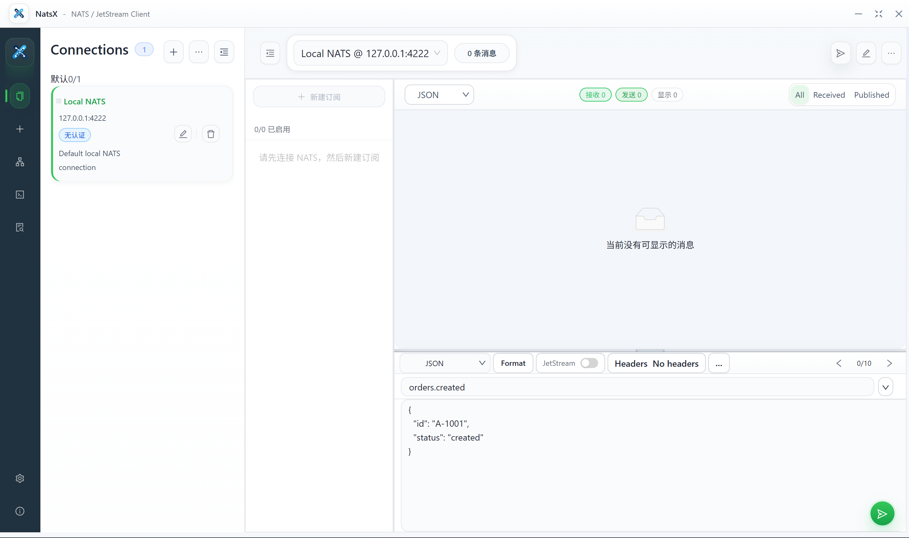

# NatsX

[English](README.md) | [简体中文](README.zh.md)

NatsX 是一个面向 `NATS / JetStream` 的桌面客户端，基于 `Go + Wails + React + Ant Design` 构建，聚焦连接管理、订阅、消息发送、`Request / Reply` 调试、JetStream 工作流与本地持久化。

- 版本：`1.0.2`
- 作者：`punk-one`
- 仓库地址：[https://github.com/punk-one/NatsX](https://github.com/punk-one/NatsX)
- Releases：[https://github.com/punk-one/NatsX/releases](https://github.com/punk-one/NatsX/releases)
- 许可证：`Apache License 2.0`

## 预览



## 功能特性

### 连接管理

- 支持连接的新建、编辑、删除、分组、导入与导出
- 支持 `No Auth`、`Username / Password`、`Token`、`TLS / mTLS`、`NKey` 与 `Credentials`
- 支持复用已上传的证书、私钥、CA 与凭据文件
- 启动时自动恢复已保存的连接与应用设置

### 消息工作流

- 订阅 Subject 并实时查看消息流
- 支持带 Headers 的消息发送与载荷格式化
- 支持 `JSON`、`Text`、`Hex`、`Base64`、`CBOR`、`MsgPack` 等载荷视图
- 保存最近发送记录，便于快速重放与复用

### Request / Reply

- 支持带超时控制的请求发送
- 并排对比原始请求、重放请求与响应结果
- 跟踪请求 ID、耗时与关联消息

### JetStream

- 浏览 Streams 与 Consumers
- 新建、更新、删除 Stream / Consumer 配置
- 从 Pull Consumer 主动抓取消息
- 在桌面界面中执行 `Ack`、`Nak`、`Term`

### 持久化与发布

- 将设置、连接、升级状态与日志统一保存到 `database/natsx.db`
- 将上传的 credentials 与 TLS 相关资源保存到应用本地目录
- 支持基于 GitHub Releases 的更新检查与手动升级
- 同时发布 `windows-amd64` 与 `linux-amd64` 两个平台便携包

## 构建

### Windows

```powershell
go run github.com/wailsapp/wails/v2/cmd/wails@v2.9.3 build -nosyncgomod -m
```

### Linux

```bash
go run github.com/wailsapp/wails/v2/cmd/wails@v2.9.3 build -nosyncgomod -m -platform linux/amd64 -nopackage -tags webkit2_41 -o NatsX
```

## `v1.0.2` 发布资产

- `NatsX-1.0.2-windows-amd64.zip`
- `NatsX-1.0.2-windows-amd64.sha256.txt`
- `NatsX-1.0.2-linux-amd64.tar.gz`
- `NatsX-1.0.2-linux-amd64.sha256.txt`
- `SHA256SUMS`
- `latest.json`

## 许可证

项目基于 `Apache License 2.0` 发布，详见 `LICENSE`。
